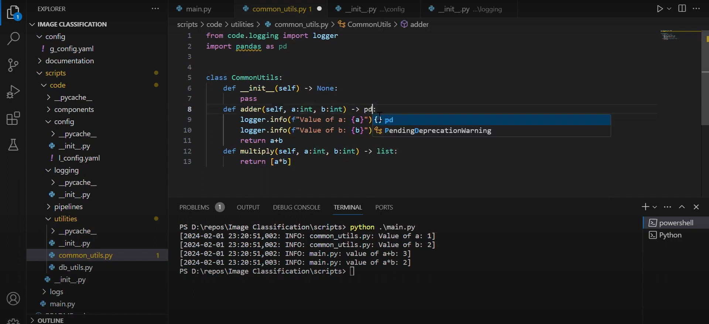

## U-Net Implementation With PyTorch

<div align="center">
    <a href="">
        
    </a>
</div>
<br/>
<div align="center">
    <p>Liked my work? a ⭐ would be appreciated!</p>
</div>


<p align="center">
  
</p>


This repository contains minimalistic implementation of U-Net that is introduced in the paper [U-Net: Convolutional Networks for Biomedical Image Segmentation](https://arxiv.org/abs/1505.04597) using PyTorch. Implementation has tested using [Carvana Image Masking Challenge](https://www.kaggle.com/c/carvana-image-masking-challenge) by Kaggle.

### YouTube Tutorial
This repository also contains a corresponding YouTube tutorial with the title **How to create a basic python repository - part - 1**

[](https://www.youtube.com/watch?v=Q63uEh_utjk)

## Model <a class="anchor" id="usage"></a>

### Project Structure <a class="anchor" id="ps"></a>
Project structured as follows:

```
.
└──
   ├── config/
   │   ├── config.yaml
   │   └── hyper_parameters.yaml
   ├── data/
   │   ├── manual_test/
   │   │   └── DCIM_1141.jpg
   ├── documentation/
   │   ├── project_documentation.docx
   │   ├── thumbnail.png
   │   └── U.png
   ├── models/
   │   └── model_description.txt
   ├── scripts/
   │   ├── code/
   │   │   ├── components/
   │   │   │   ├── blocks.py
   │   │   │   ├── dataset.py
   │   │   │   ├── model_architecture.py
   │   │   │   └── __init__.py
   │   │   ├── config/
   │   │   │   ├── config.yaml
   │   │   │   └── __init__.py
   │   │   ├── logging/
   │   │   │   └── __init__.py
   │   │   ├── pipelines/
   │   │   │   ├── data_gathering.py
   │   │   │   ├── data_preparation.py
   │   │   │   ├── model_inferencing.py
   │   │   │   ├── model_training.py
   │   │   │   └── __init__.py
   │   │   ├── utilities/
   │   │   │   ├── common_utils.py
   │   │   │   └── __init__.py
   │   │   └── __init__.py
   │   ├── logs/
   │   │   └── __init__.py
   │   └── main.py
   ├── .git
   ├── README.md
   ├── requirements.txt
   └── template.py

```

### Pre-Trained Model <a class="anchor" id="ptm"></a>
You can download a sample pre-trained model from [here](https://drive.google.com/file/d/1evei4cZkBlpoq70iapItN1ojldIXSOc2/view?usp=sharing). Put the model into the `models/` directory.

## Contact <a class="anchor" id="contact"></a>
You can contact me with this email address: psairam9301@gmail.com
